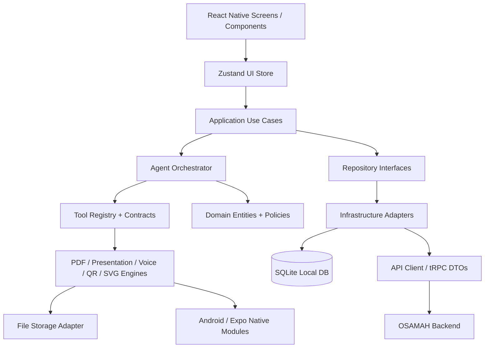
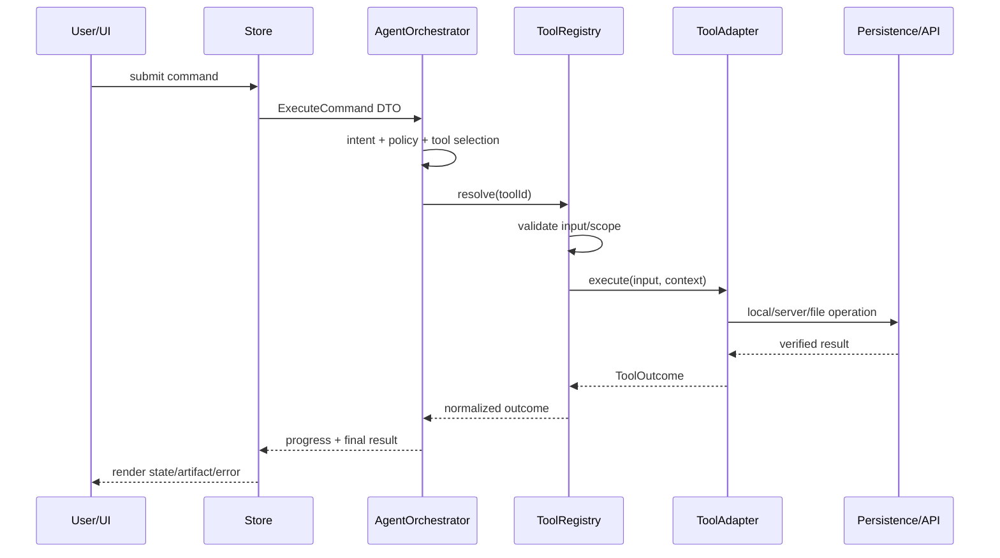
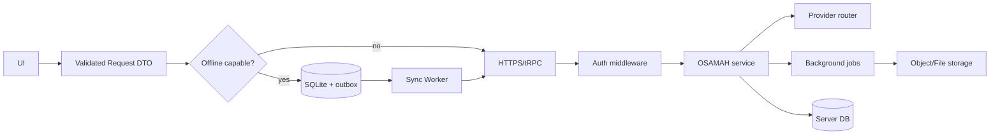

# Osamah Agent — Architecture Plan

## النطاق والافتراضات

هذه الخطة مبنية على فحص فعلي للمشروع الرئيسي وخمسة مستودعات مساندة متاحة. تم تجاهل `AmrDeveloper/CV-Maker` و`crnacura/react-native-mindmap` بناءً على تفويض المستخدم؛ لا يُفترض أن قدراتهما موجودة، ولا يُسمح بإنشاء بديل وهمي باسم أي منهما.

المشروع الرئيسي تطبيق Expo/React Native يعمل كـ thin client ويستخدم حاليًا Zustand وexpo-sqlite وtRPC و`pdf-lib`. الهدف هو إدخال قدرات الأدوات خلف عقود مستقلة، مع إبقاء UI وAgentCore غير مرتبطين بتفاصيل المكتبات.

## المبادئ

1. **Correctness ثم stability ثم performance ثم scalability ثم maintainability.**
2. الـ UI يستدعي Use Cases فقط، ولا يستورد مكتبات الأدوات مباشرة.
3. `ToolRegistry` هو نقطة الدخول الوحيدة لاستدعاء الأدوات من الوكيل.
4. كل Adapter قابل للاستبدال، وكل نتيجة تحمل حالة صريحة بدل الإيحاء بنجاح غير حقيقي.
5. الأعمال الثقيلة والملفات الكبيرة لا تُنفّذ متزامنة على مسار واجهة المستخدم.
6. Server-first للذكاء الاصطناعي والمصادقة، وlocal-first للبيانات التشغيلية القابلة للعمل دون اتصال.
7. لا ندمج تطبيقات الأمثلة كاملة؛ نستخدم المكتبات والواجهات العامة فقط.

## الطبقات والوحدات



| الطبقة | المسؤولية | ممنوع عليها |
|---|---|---|
| UI | العرض، الإدخال، RTL، accessibility، حالات التحميل والخطأ | استدعاء SQLite أو مكتبات الأدوات أو API مباشرة |
| Zustand Store | حالة العرض قصيرة العمر والتنسيق مع Use Cases | احتواء منطق PDF/QR/الصوت التفصيلي |
| Application | حالات الاستخدام، orchestration، retries، idempotency | معرفة تفاصيل React |
| Domain | عقود الأدوات، الكيانات، سياسات الصلاحيات، حالات النتائج | استيراد Expo أو مكتبات خارجية |
| Agent | فهم النية، اختيار الأداة، التخطيط، حدود confirmation | تنفيذ مكتبة بعينها مباشرة |
| Tool Registry | تسجيل الأدوات، schema validation، scopes، dispatch | ربط UI أو تخزين عشوائي |
| Infrastructure | SQLite، HTTP/tRPC، الملفات، native bridges | تقرير نجاح قبل تحقق المصدر |
| Backend | الأسرار، AI providers، jobs، authorization، file processing | كشف المفاتيح للجهاز |

## عقود الأدوات

```ts
export type ToolId =
  | 'research.search'
  | 'browser.open'
  | 'document.pdf'
  | 'presentation.create'
  | 'voice.assistant'
  | 'graphics.qr';

export type ToolScope = 'read' | 'local-write' | 'network' | 'sensitive';

export interface ToolContext {
  requestId: string;
  userId?: string;
  conversationId: string;
  signal?: AbortSignal;
  isOnline: boolean;
}

export interface ToolDefinition<I, O> {
  id: ToolId;
  version: string;
  scope: ToolScope;
  inputSchema: unknown;
  execute(input: I, context: ToolContext): Promise<ToolOutcome<O>>;
}

export type ToolOutcome<T> =
  | { state: 'completed'; data: T; artifacts: ArtifactRef[]; warnings: string[] }
  | { state: 'needs_confirmation'; reason: string }
  | { state: 'offline'; retryable: boolean; message: string }
  | { state: 'failed'; code: string; message: string; retryable: boolean };
```

المكتبات المساندة تدخل عبر adapters:

| القدرة | المصدر المفحوص | مكان الدمج المخطط | سياسة الدمج |
|---|---|---|---|
| Voice assistant | `livekit-examples/agent-starter-react-native` | `infrastructure/voice/LiveKitVoiceAdapter` | استخراج نمط الاتصال والتوكن فقط؛ لا نسخ شاشة المثال. يحتاج Dev Client وWebRTC واختبار Android مستقل. |
| PDF | `diegomura/react-pdf` | `infrastructure/rendering/PdfRendererAdapter` | لا يُفرض على Native مباشرة؛ يُستخدم على backend/Node أو مسار متوافق بعد اختبار. يبقى `pdf-lib` المحلي fallback إلى حين إثبات التوافق. |
| Presentation | `FormidableLabs/spectacle` | `infrastructure/rendering/SpectacleAdapter` | مناسب لتكوين/عرض React Web؛ ليس قرارًا تلقائيًا لتصدير PPTX على Android. يُعزل خلف `PresentationRenderer`. |
| SVG | `software-mansion/react-native-svg` | `infrastructure/graphics/SvgRendererAdapter` | موجود أصلًا كتَبعية في المشروع الرئيسي؛ يُثبت الإصدار ويُستخدم عبر مكونات/عقد graphics. |
| QR | canonical `Expensify/react-native-qrcode-svg` | `infrastructure/graphics/QrCodeAdapter` | يمر عبر `react-native-svg` كـ peer dependency؛ يحتاج إضافة تبعية واختبار Android قبل تفعيل UI. |
| CV-Maker | غير متاح | لا يوجد دمج | خارج النطاق المصرح به، لا بديل تلقائي. |
| MindMap | غير متاح | لا يوجد دمج | خارج النطاق المصرح به، لا بديل تلقائي. |

## Agent Tool Flow



## Data Flow وAPI Flow



العقود المقترحة، مع إبقاء أسماء الإجراءات الحالية متوافقة مؤقتًا:

- `GET /health` أو `osamah.health.query`: readiness وschema version.
- `GET /capabilities` أو `osamah.capabilities.query`: capabilities مع `available/review_only/unavailable`.
- `GET /opencode/models?offset&limit&search`: pagination حقيقية وعدم تحميل الكتالوج كله.
- `POST /opencode/chat`: body validated، `confirmed: true` عند الحاجة، timeout وrequest id.
- `POST /voice/transcribe`: streaming/chunked upload للملفات الكبيرة، لا تخزين دائم افتراضيًا.
- `POST /voice/tts`: binary response مع `Content-Type` و`X-Voice`.
- مستقبلًا: `POST /jobs` و`GET /jobs/:id` للـ PDF/العروض الثقيلة، مع idempotency key.

## قاعدة البيانات المحلية

الحالي يحتوي على profiles وmemories وconversations وmessages وtasks وpresentations وslides وaudit_logs وvoice_settings. التعديلات المرحلية المقترحة:

- إضافة `schema_migrations(version, appliedAt)` بدل الاعتماد على فحص عمود فقط.
- إضافة indexes: `messages(conversationId,timestamp)`, `memories(category,importance,timestamp)`, `slides(presentationId,slideNumber)`, `audit_logs(timestamp)`, `tasks(status,createdAt)`.
- إضافة `artifacts(id, kind, uri, mimeType, sizeBytes, checksum, status, createdAt)`.
- إضافة `outbox(id, aggregateType, aggregateId, operation, payloadJson, attempts, nextAttemptAt, status)`.
- استخدام transactions عند إنشاء conversation + message، وإنشاء presentation + slides، وتسجيل artifact.
- عدم تحميل كل الرسائل/الشرائح؛ pagination بـ `LIMIT/OFFSET` أو cursor حسب الحالة.

## Offline / Online

- **محلي:** profile، memories، conversations، messages، task drafts، presentation draft، artifact metadata.
- **خادم:** AI calls، provider keys، authoritative search sources، long-running jobs، user/account authorization.
- **على الجهاز:** UI state، QR/SVG rendering، lightweight PDF fallback، audio playback.
- **عامل خلفي/خادم:** PDF كبير، تحويل صوت كبير، تصدير عرض، عمليات AI متعددة الخطوات.
- كل write network له outbox أو حالة `pending_sync`، مع exponential backoff وdeduplication.

## الأداء والاستقرار على Android

- استخدام Hermes، lazy imports للـ PDF/voice/rendering.
- عدم تنفيذ `ArrayBuffer` أو PDF كبير داخل render path.
- `FlatList`/virtualized lists للرسائل والشرائح والسجل.
- debounce للبحث، وإلغاء الطلب السابق بـ `AbortController`.
- نقل الصوت والتصدير الثقيل إلى native/backend عند ثبوت الحاجة بالقياس.
- منع duplicate submits باستخدام request id وstore guard.
- instrumentation: startup duration، JS frame drops، memory warnings، tool latency، failure rate، artifact size.

## الأمن

- أسرار مزودي AI لا تدخل Expo bundle.
- توكن LiveKit قصير العمر صادر من backend فقط.
- validation للـ URL والملفات، حدود الحجم ونوع MIME.
- authorization على مستوى user وconversation وartifact، لا الاعتماد على إخفاء زر UI.
- redaction للـ tokens وPII في logs.
- audit log للعمليات الحساسة وconfirmation صريح.

## استراتيجية الاختبار

1. Unit: intent routing، schemas، migrations، retry policy، adapters باستخدام mocks.
2. Contract: API DTOs مقابل استجابات الخادم الحقيقية.
3. Integration: SQLite، file storage، QR/SVG، PDF adapter، LiveKit token flow.
4. E2E Android: startup، RTL، offline، reconnect، voice، generation، share artifact.
5. Performance: 10k messages، 1k slides، PDF كبير، network throttling، memory pressure.
6. Release gate: `npm ci`, typecheck، lint، tests، `expo prebuild --platform android`، Gradle/APK إذا توفرت Android SDK وcredentials.

## خطة التنفيذ المرحلية

1. تثبيت baseline: typecheck، lockfile، Expo doctor، وعدم تغيير السلوك.
2. إنشاء domain contracts وToolRegistry وnormalised outcomes.
3. نقل الأدوات الحالية إلى adapters دون تغيير UI.
4. إضافة QR/SVG adapter بعد توافق dependency.
5. عزل PDF وPresentation renderer خلف interfaces، ثم اختبار مسار كل منصة.
6. عزل LiveKit خلف voice port، وتفعيل Dev Client فقط عند نجاح build.
7. إضافة artifact/outbox migrations وpagination.
8. إضافة telemetry والاختبارات.
9. Android prebuild/build وsmoke tests.

لا يبدأ تغيير package.json أو الكود الإنتاجي قبل نجاح baseline وتسجيل أي فشل فعلي.
